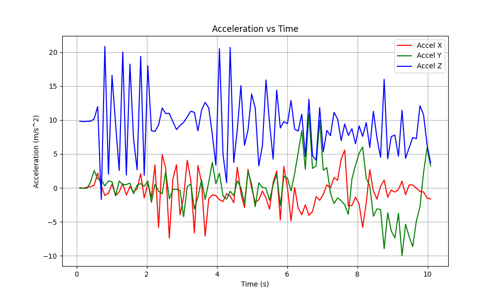

# Accelerometer-Data-Collection-and-Processing

This project configures the Adafruit ISM330DHCX + LIS3MDL FeatherWing to capture accelerometer data, 
logs it via serial communication into a CSV file, and visualizes the data in graphs for further analysis.

## Table of Contents
1. [What is this for?](#what-is-this-for)
2. [How to use it](#how-to-use-it)
3. [Prerequisites](#prerequisites)
4. [Notes](#notes)
5. [Troubleshooting](#troubleshooting)
6. [Disclaimer](#disclaimer)
7. [License](#license)

## What is this for?

This project is part of a bridge monitoring system where accelerometer data is used to assess the structural health 
of small to medium-sized bridges. By capturing and analyzing vibration data, this system aids in the early detection of potential 
structural issues. The scripts provided here collect raw data from the ISM330D sensor, save it to a CSV file, and plot it for analysis.

## How to use it

1. **Compile and upload** the accelerometer data collection files to your microcontroller to start data collection from the ISM330D.
   - Connect your ESP32 or Arduino to the ISM330DHCX accelerometer.
   - Install the Arduino IDE and add the LIS3MDL and LSM6DS libraries in the IDE.
   - **Note**: Run example code from the library first to verify that the ESP32 or Arduino connects to the accelerometer.

2. **Run** `SerialToCsv.py` to save the serial data into a CSV file.
   - This script should create the CSV file in the same directory.
   - Close the Arduino IDE or any application monitoring the serial port before running this script.
   - Ensure you are using the correct port and baud rate.

3. **Visualize** the data using `CsvToGraph.py` to generate graphs of the collected data.
   - If both Python scripts are in the same directory, `SerialToCSV.py` will save the CSV there, which `CsvToGraph.py` can access directly.
   - If the scripts are in separate directories, place the CSV file in the same directory as `CsvToGraph.py` or specify the path to the CSV file.

4. **Important Information**:
   - When the accelerometer is stationary, the graph will look linear, with one axis offset by gravity.
   - Moving the accelerometer will produce a graph with more variation in the axes.
   - Your CSV output should look similar to the example provided.
   - [Sensor_Data.csv](Examples/sensor_data.csv)
   - The example CSV provided is the data shown in the graph below.
   

## Prerequisites

- **Hardware**:
  - Adafruit ESP32 Feather Board
  - Adafruit ISM330DHCX + LIS3MDL FeatherWing

- **Software**:
  - Python 3.x
  - Required Python libraries:
    ```bash
    pip install csv pyserial matplotlib
    ```
  - Arduino IDE
  - Required Arduino libraries: LIS3MDL & LSM6DS by Adafruit

## Notes

- Read all instructions thoroughly before starting data collection.
- Ensure the ESP32 and accelerometer are connected correctly to maintain data accuracy.

## Troubleshooting

- **No data in CSV**: Verify that the serial connection is configured correctly and that the ESP32 is outputting data.
- **Graphing issues**: Ensure `SerialToCsv.py` has formatted the data correctly before running `CsvToGraph.py`.
- **Python import errors**: Confirm that all required Python libraries are installed.

## Disclaimer

Use this program at your own risk. The author is not responsible for any potential damage to your system.

## License

This project is licensed under the MIT License. See the `LICENSE` file for details.
