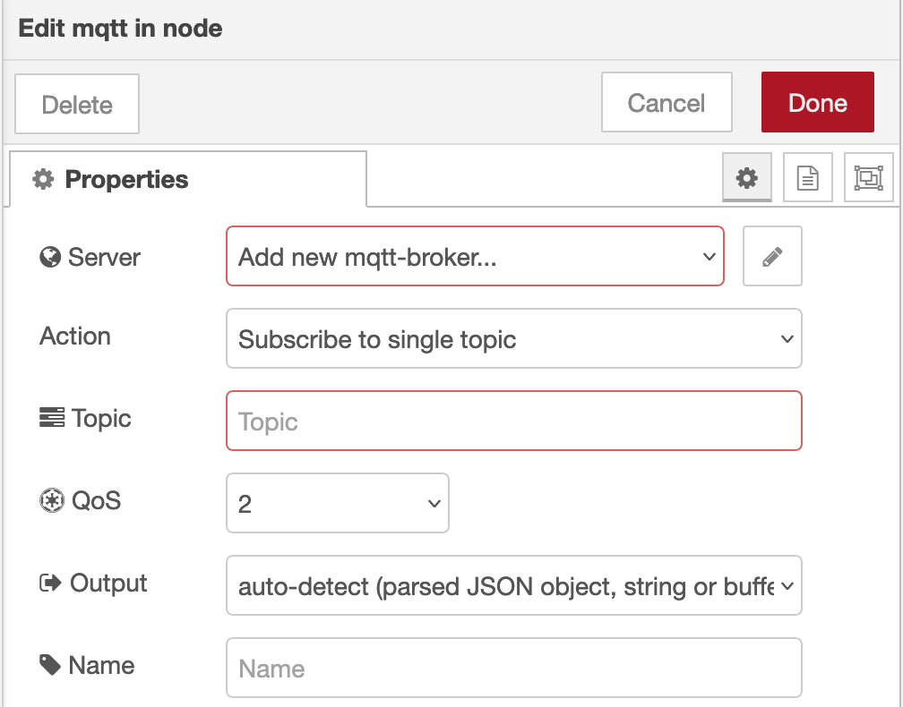
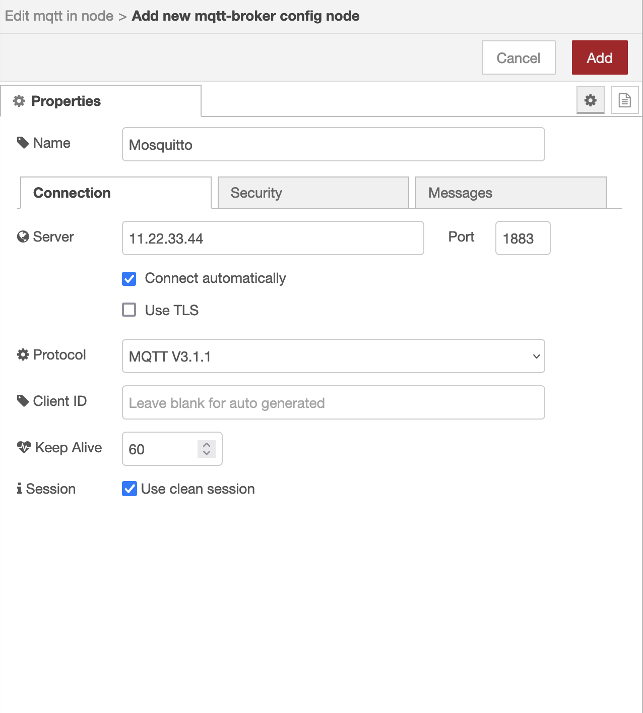
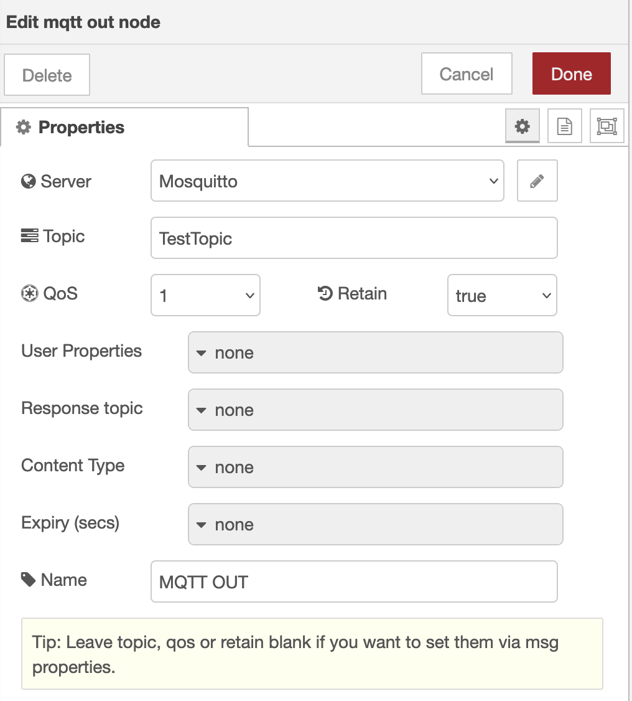
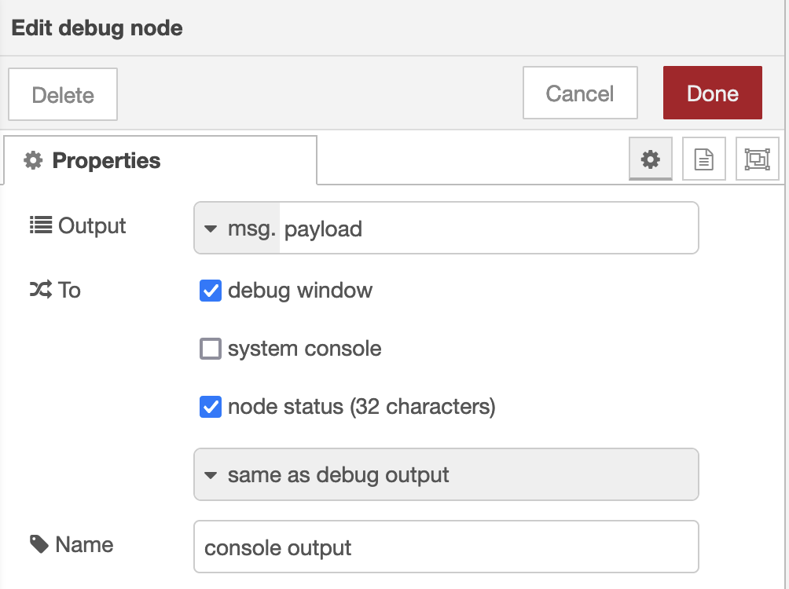
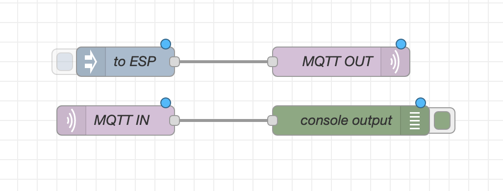

# Mosquitto Setup
- Create mosquitto.pw and mosquitto.conf
 - In our example, we chose these paths based on our docker-compose.yml
   - /var/lib/mosquitto/config/mosquitto.conf
   - /var/lib/mosquitto/config/mosquitto.pw
- Encrypt the password file using: `mosquitto_passwd -U mosquitto.pw`


mosquitto.conf example:
```
allow_anonymous false
listener 1883
persistence true
persistence_location /mosquitto/data/
log_dest file /mosquitto/log/mosquitto.logs true
password_file /path/to/mosquitto.pw
```


mosquitto.pw example (before encryption):
```
username1:password1
username2:password2
username3:password3
...
```

More info can be found [here](http://www.steves-internet-guide.com/mqtt-username-password-example/)

# Node-RED

Configuring mqtt workflow using the default port value of 1883 for Mosquitto:

[Connecting MQTT Broker (Mosquitto)](https://cookbook.nodered.org/mqtt/connect-to-broker)

We need an mqtt broker node to work with the MQTT input and MQTT output nodes. 

While accessing Node-RED, add the
- mqtt in
- mqtt out
- inject
- debug
nodes to the workflow.

Node-RED Node Configuration
### MQTT In


### MQTT Broker 
Add a new broker by clicking the edit button to the right of "Add new mqtt-broker..."


### MQTT Out


### Debug


### Final Result


[Node-RED Documentation](https://cookbook.nodered.org/)
