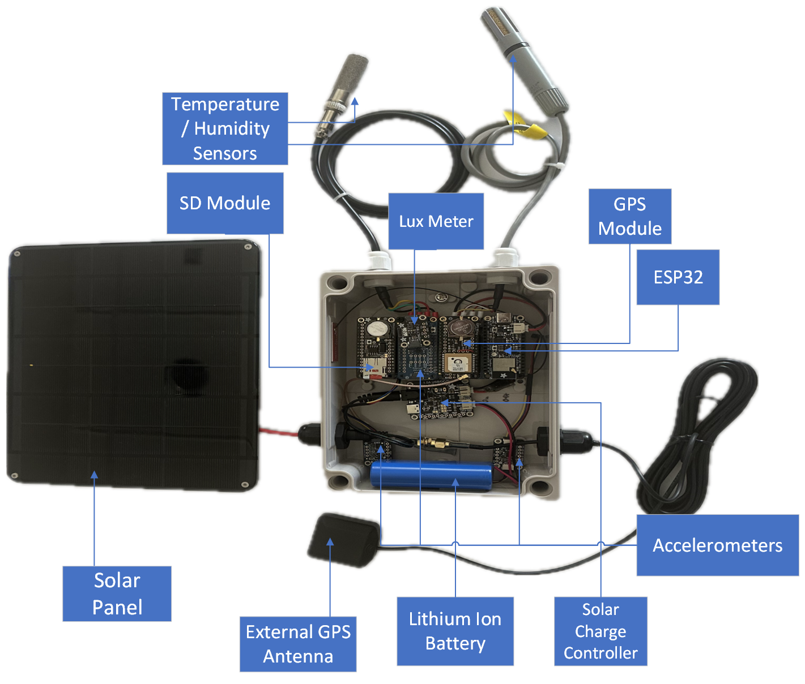

# WISE-Framework (Fall 2023 - Spring 2024)
The Wireless Intelligent Sensor Ecosystem (WISE) Framework is an open-source modular project with examples for managing and deploying low-cost sensors for bulk data collection, with a focus on structural and environmental data collection.

This is the first prototype developed specifically for this project, designed to test many aspects and allow for easier development. WISE Sensors can take a smaller shape with fewer or more sensors, as needed.

This project was originally intended to be a single accelerometer affixed to a structure, such as a bridge, to monitor the structural health by observing the transmitted frequencies and harmonics.

This project framework currently offers the end user the ability to connect as many sensors as they want, within the physical limitations of the microcontroller, and manages the collection of the data.

## Features
* High-rate polling (up to at least 600hz, shared between all connected sensors)
* Low-rate polling (unlimited interval (in seconds) between sensor polling
* Independent polling speed for each sensor
* Modular design using low-cost readily available Arduino-compatible sensors and microcontrollers
* Self-sufficient design operated from solar power, designed to be used outdoors
* Central time-series database with InfluxDB (locally- or cloud-hosted)
* Data visualization utilizing Grafana
* Remote sensor management using NodeRed

## Example Use Cases
* Structure monitoring with accelerometers
* Rainfall monitoring
* Water/liquid level monitoring in tanks or outdoors
* Air quality monitoring
* Mini weather station(s)
* Vehicle/vessel-mounted trip/environmental monitoring

## How it Works
### Core Structure of the ESP32 Framework
- The framework is designed around the ESP32 S-series microcontroller family and utilizes both cores. 
- Core 0 of the ESP32 is tasked with handling interrupts to process all time-sensitive sensor polling and data storage as well as the time resync through the GPS module.
- Core 1 of the ESP32 is tasked with managing all the low-rate sensors using software timers as well as handling the wireless connection to the remote database and the initial setup procedure during boot-up.

### Processes on ESP32
- With the GPS Module, the precise "Pulse Per Second" output is used, which goes to a 'high' state for a very short duration at the start of every second, which can be utilized to counteract any natural drift of the internal clock. 
- Using this precise time, every data point collected has a precise timestamp attached, such that the data between multiple independent WISE Sensors will all show the same timestamp if collected at the same time, which allows for data analysis such as measuring the wave propagation speed through a material or structure.
- Periodically, when the internal buffer for the data is approaching capacity, all data is diverted to an alternate buffer while the primary buffer is transmitted to the remote server database before the alternate buffer is loaded into the primary buffer and cleared, ready for the next cycle with no data lost.
- Additionally, the data can be written directly to an SD card connected to the ESP32 as it is being collected, either in-place-of or in-addition-to the database logging.

### Server Functions
- When the data reaches the server, InfluxDB manages the storage of all the data, utilizing the included timestamp tag. This also means data can be added later by loading it from the SD card.
- To visualize the data, InfluxDB offers a few basic graphs, but for more advanced visualization and analysis Grafana is used, which also allows for Python scripts to process the data.
- From the server, each WISE Sensor can also be remotely controlled using NodeRed. Currently, it is possible to start and stop data recording, as well as to force the ESP32 to restart in the event of anomalous behavior.

## Hardware
The project is based around an ESP32 microcontroller, with an attached GPS module for real-time time synchronization. Connect any compatible sensor to the ESP32, and that represents the core of this project.

Optionally, you can add more sensors, a battery, a solar panel with a charge controller, an SD Card, a display, a LoRa radio, or anything else compatible with the ESP32. Put it all in a water-resistant box, and it can be deployed outside for remote sensing tasks.

A [sample BOM](../Sensor%20BOM.xlsx) is provided, primarily utilizing Adafruit as a vendor. The Feather series of development boards makes things very easy to prototype with and develop small-batch projects.

## Software Setup
The code is designed such that most configurations will take place exclusively in [Configuration.h](ESP_Sensor_Framework_Template/Code/Configuration.h).

Support for additional sensor modules will need to be added to the appropriate sensor support file, depending on the frequency it needs to be polled at.

The template code is available here, designed to be modified and uploaded to the ESP32 using Arduino IDE.

## Server Setup
The framework is built using four different applications running on four separate docker containers.
- [InfluxDB](https://www.influxdata.com/) - Time Series Database
- [Grafana](https://grafana.com/) - Data Visualization
- [Node-RED](https://nodered.org/) - Sensor Management
- [Mosquitto](https://mosquitto.org/) - MQTT Broker

### Prerequisites
[Docker](https://docs.docker.com/get-docker/)

[Docker Compose](https://docs.docker.com/compose/install/) - If using docker compose

### Container Preparation
Prepare the config files for the Mosquitto container using the instructions [here](Documentation/docker/Node-RED_and_Mosquitto.md).

Using docker compose, you can run the [docker-compose.yml](Documentation/docker/docker-compose.yml) with `docker compose up`.

or running the docker commands from [here](Documentation/docker/docker_commands.md).

### InfluxDB
- Complete the initial setup through the website. (www.example.com:8086).
- Create a bucket

### Grafana
- Complete the initial setup through the website. (www.example.com:3000)
  - default username: admin
  - default password: admin

#### Configuring the datasource
Navigate to Home > Connections > Add new connection
- Select InfluxDB > Add new data source

Query Language - Flux

HTTP URL: http://\<docker_container_name\>:port (http://yourInfluxName:8086)

Custom HTTP Headers > Add Header

Header: "Authorization" 

Value: "Token YOUR_API_TOKEN_HERE"

Organization: "YOUR_ORG_ID_HERE"

## ToDo & Future Expansions
- [X]  Publish project to GitHub
- [X]  Test on multiple servers
- [X]  Add SD Card Support for local data logging
- [ ]  Test the time synchronization with the GPS module
- [ ]  Test the water resistance of the hardware box
- [ ]  Add a license to this repository
- [ ]  Design second prototype with a smaller case and 1 sensor
- [ ]  Expand and improve documentation
- [ ]  Validate long-term durability of design, physical and digital (is heat an issue?)
- [ ]  Restructure the codebase to make each sensor's functions a separate source file that can be included or excluded with only a line or two of code (compiler directives?)
- [ ]  Test and improve high-rate data transfer to InfluxDB
- [ ]  Validate and reliability test multiple sensors to one MCU, some with long wires
- [ ]  Improve NodeRed control to allow individual sensor management
- [ ]  Add deep sleep to ESP, controlled by NodeRed
- [ ]  Add battery level monitoring
- [ ]  Implement power conservation designs, utilizing deep sleep
- [ ]  Setup more Grafana data visualization and analysis suites
- [ ]  Update transmission protocol to retry sending data that was saved to SD due to transmission failure
- [ ]  Add ability for data transfer to another device or internet when in range, but it collects data continuously
- [ ]  Add serial connectivity to allow data to be sent to a secondary microcontroller for AI-based anomaly detection
- [ ]  Add Lo-Ra support for long-distance status updates
- [ ]  Add BLE support for an ad-hoc or other network structure, with only 1 or few nodes transmitting to the internet
- [ ]  Improve security and data integrity
- [ ]  Add additional sensor modules to the base code
- [ ]  Add support for/test on other MCUs, such as ESP8266
- [ ]  Add real demos of this system in use
